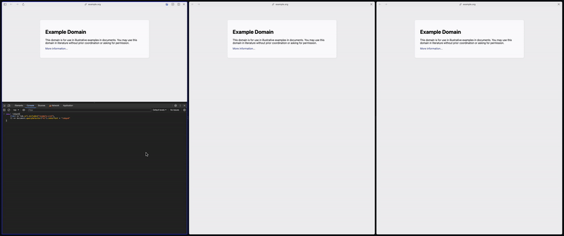

<h1 align="center">
  
  <br />
  tabgod
</h1>

execute _any_ javascript on _any_ chromium tabs

- adds options page with `tabgod()` function

```ts
async function tabgod(
  tabFilterFunc: (tab: chrome.tabs.Tab, ...args: unknown[]) => boolean,
  exeFunc: (...args: unknown[]) => unknown,
  options?: {
    tabFilterArgs?: unknown[];
    exeArgs?: unknown[];
    evalAdd?: string;
  },
): Promise<{ tabId: number; result: unknown }[]> {
  //
}
```



## installation

- clone repo
- goto _your-chromium-based-browser://extensions/_
  - example: _arc://extensions/_
- make sure to have 'Developer mode' enabled
- 'Load unpacked' choose path to ./dist of repo

## usage

1. open extensions options page
2. open devtools console
3. use provided `tabgod()` function
   1. choose execution targets by writing a filter function that will
      include/excluce tabs based on defined criteria
      - https://developer.chrome.com/docs/extensions/reference/api/tabs#type-Tab
   2. write any js to execute in world of targeted tabs

```js
tabgod(
  (tab) => tab.url.includes("example.org"),
  () => document.body.style.background = "pink",
);
```

## notes on first release

- initial idea was to make tabgod function available in all devtools consoles
  for easy and direct access for developers right from every console
- the implementation added tabgod to the global window object
- however this introduced a serious security issue, since this has made the
  function avaialbe to websites also, allowing them to interact with other tabs,
  destroying the idea of secure tab origins
- thanks to
  [danielsmc pointing it out](https://github.com/devidw/tabgod/issues/1#issue-2124285330)
- this has been immediately addressed by moving the function only to the options
  page of the extension, and not accepting external connections in the service
  worker
